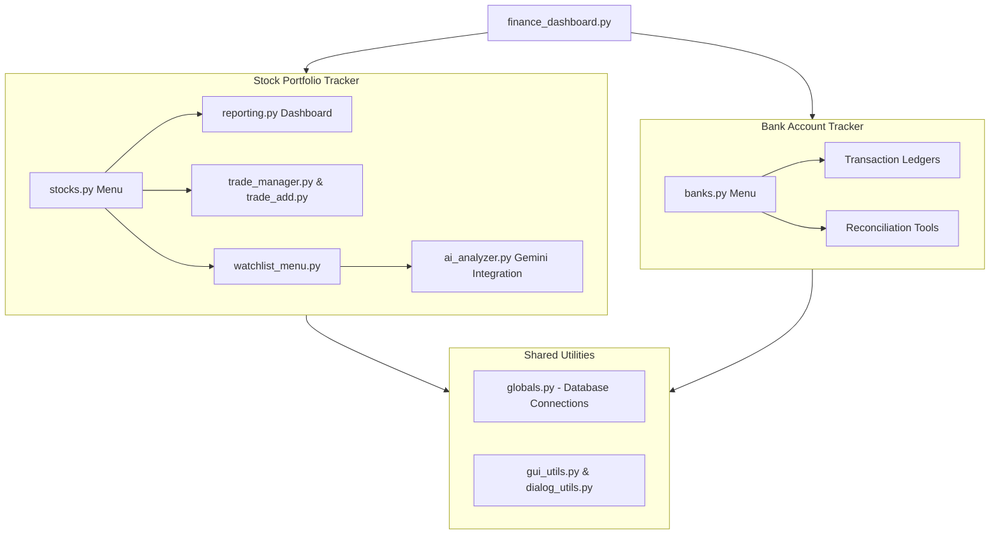

# Universal Finance Manager

Universal Finance Manager is a desktop-based financial tracking and investment analytics application built with Python and Tkinter. The application serves as a central hub for managing stock portfolios (`StockMan`) and tracking bank accounts/transactions (`BankMan`). It integrates live market data via `yfinance` and artificial intelligence via the modern Google Gemini API to deliver institutional-grade investment insights.

---

## Architecture Overview



---

## Key Features

### 📊 StockMan (Stock Portfolio Tracker)
- **Interactive Portfolio Analytics**: A detailed dashboard displaying stock-wise performance, overall P&L, current holdings, sector allocations, and chronological transaction ledgers.
- **FIFO Profit & Loss Engine**: Automatically matches sells against buys in First-In-First-Out order, tracking realized gains, unrealized gains, and annualized returns (XIRR).
- **Online Corporate Actions Reconciliation**: Fetches dividend records, stock splits, and bonus issues directly from Yahoo Finance and compares them with local broker imports to flag discrepancies.
- **AI Portfolio Advisor**: Integrates Google Gemini (via `gemini-2.5-flash`) to generate plain-English technical analysis explanations and search broker research reports for institutional buy/sell recommendations.

### 🏦 BankMan (Bank Account Tracker)
- **Account Management**: Track multiple savings accounts, fixed deposits (FD), credit cards, and loan balances.
- **Categorized Transaction Ledgers**: Categorize and review monthly cash inflows/outflows.

---

## 🔒 Security Best Practices

To ensure that your sensitive personal data is protected when pushing this codebase to public Git repositories like GitHub, the project includes a strict Git configuration:

1. **Ignored Databases**: The local SQLite database files (e.g. `mystocks.db`, `mybanks.db`) inside the `data/` directory are excluded from Git tracking via `.gitignore`. Only the folder structure is preserved.
2. **Hidden API Keys**: All personal Gemini API keys have been removed from the source code. The application resolves API keys dynamically from a local, Git-ignored `api_key.txt` file or system environment variables.

---

## ⚙️ Installation & Setup

### 1. Prerequisites
Ensure you have Python 3.10 or higher installed on your system.

### 2. Install Dependencies
Install the required third-party Python packages using `pip`:
```bash
pip install yfinance google-genai matplotlib pandas pytest
```

### 3. Configure Gemini AI API Key
The AI advice features require a Google Gemini API Key. You can get a free-of-cost key from [Google AI Studio](https://aistudio.google.com/).

To configure the key:
1. Create a file named `api_key.txt` in the project root directory.
2. Paste your API key into it:
   ```text
   AIzaSy...your-actual-key-here...
   ```
Alternatively, set the environment variable `GEMINI_API_KEY` on your machine:
- **Windows**: `setx GEMINI_API_KEY "your-api-key"`
- **Linux/macOS**: `export GEMINI_API_KEY="your-api-key"`

---

## 🚀 How to Run

Launch the application hub by executing the main script:
```bash
python finance_dashboard.py
```
From the main menu:
- Press **[S]** or click **Launch StockMan** to open the Stock Portfolio tracker.
- Press **[B]** or click **Launch BankMan** to open the Bank Account tracker.
- Press **[X]** or click **Exit** to close the program.
